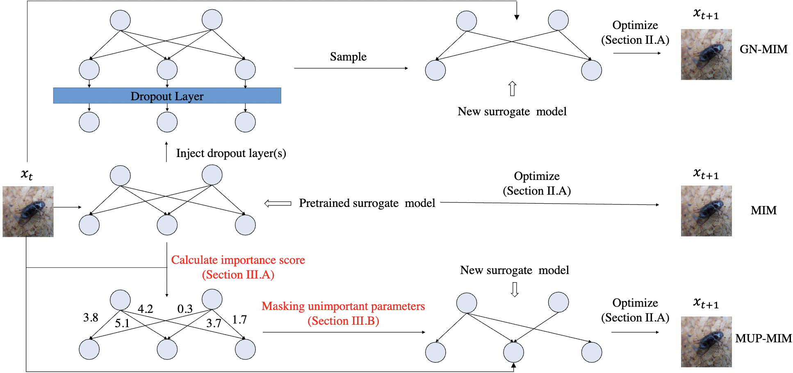

## MUP-Attack

This repository is the official repository for our paper "Generating Adversarial Examples with Better Transferability via Masking Unimportant Parameters of Surrogate Model". This repository provides codes for performing MUP-based adversarial attack methods.

<p align="center">
  
</p>


## Running Commands

You can run the following command to perform the MUP-MIM attack method, using an Inception-v3 model as a surrogate model.

```
python attack.py -a inceptionv3 --attack_method MIFGSM --pruning_mode dynamic --p 0.15
```

Please refer to `attack.py` for more details.

## Citation

If you benefit from our work in your research, please consider to cite the following paper:

```
@inproceedings{yang2023generating,
  title={Generating Adversarial Examples with Better Transferability via Masking Unimportant Parameters of Surrogate Model},
  author={Yang, Dingcheng and Yu, Wenjian and Xiao, Zihao and Luo, Jiaqi},                                              
  booktitle={2023 International Joint Conference on Neural Networks (IJCNN)},
  year={2023},
  organization={IEEE}         
}
```
